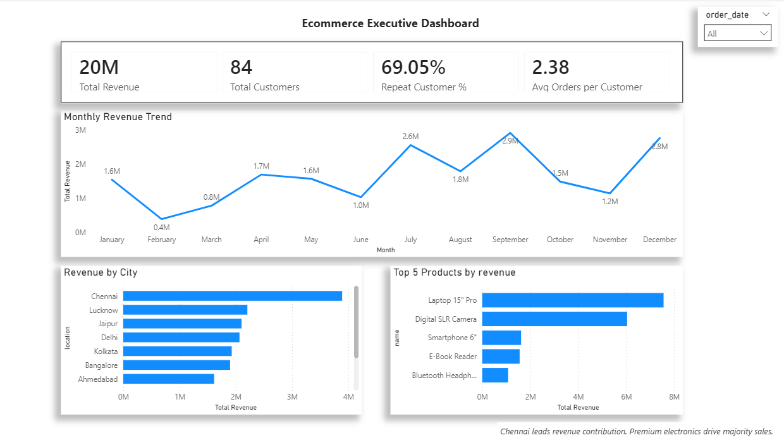

# Ecommerce Analytics Dashboard

This project analyzes ecommerce performance using SQL and Power BI. It includes data modeling, revenue analysis, customer retention insights, and an interactive dashboard for executive decision-making.

## Tools Used

* SQL
* Power BI
* Excel

## Key Insights

* Revenue concentrated in premium products
* Strong repeat customer behavior
* Chennai leads regional revenue

## Dashboard Preview

